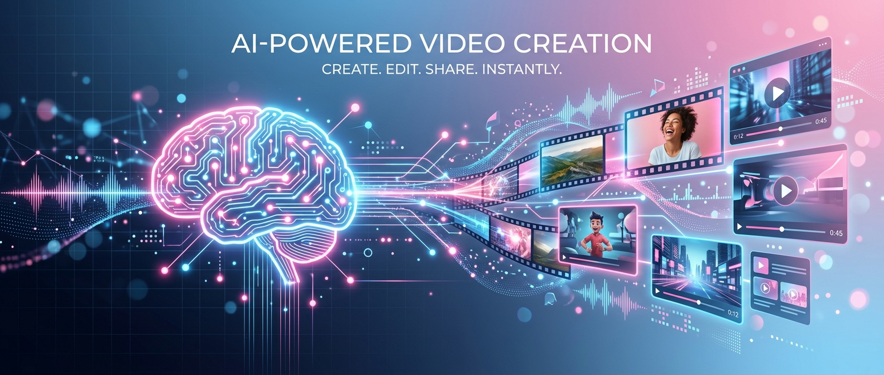

# CreatorFlow AI 🎨✨

**CreatorFlow AI** je vaš ultimativni inteligentni asistent za upravljanje cijelim životnim ciklusom video produkcije. Od inicijalne iskre ideje do viralnog objavljivanja, CreatorFlow koristi snagu Gemini AI modela kako bi kreativcima omogućio brži, pametniji i konzistentniji workflow.

## 🚀 Glavne Funkcije

Aplikacija je strukturirana kroz šest ključnih faza koje prate razvoj vašeg sadržaja:

1.  **Planiranje (Plan)**: Generirajte koncepte, strategije i teme za svoje videe na temelju početnih misli.
2.  **Produkcija (Produce)**: Dobijte precizne upute (prompte) za AI alate za generiranje slika, videa i zvuka.
3.  **Montaža (Edit)**: Napredne upute za uređivanje, uključujući prijedloge za prijelaze (Zoom Blur, Whip Pan), efekte (VHS, Film Grain) i rezanje prema vremenskim kodovima.
4.  **Objavljivanje (Publish)**: Optimizacija za lansiranje, pisanje privlačnih naslova i opisa.
5.  **Brending Audit**: Analiza vašeg dosadašnjeg stila i savjeti za postizanje vizualne konzistentnosti.
6.  **AI Avatar & Persona**: Razvijte digitalnu personu koja će predstavljati vaš brend u AI prostoru.

## 💡 Inovativne Mogućnosti

-   **A/B Testiranje Naslova**: Eksperimentirajte s različitim naslovima i označite pobjednika kako bi vaš sadržaj imao najbolji mogući "click-through rate".
-   **Sustav Povratnih Informacija**: Korisnici mogu ocjenjivati kvalitetu AI odgovora u svakoj fazi, omogućujući aplikaciji da uči i bolje se prilagođava vašim potrebama.
-   **Napredne Opcije Uređivanja**: Mogućnost preciznog navigiranja kroz tehničke aspekte montaže izravno unutar AI korespondencije.

## 🔮 Budući Razvoj (Roadmap)

CreatorFlow AI se neprestano razvija. Planiramo uvesti:
-   **Izravna Integracija s Video Alatima**: API veze za izravni izvoz promptova u alate kao što su CapCut, Premiere Pro ili AI video generatori (Sora, Runway).
-   **Višekorisnička Kolaboracija**: Timski rad na istim projektima u stvarnom vremenu.
-   **Analitika u Stvarnom Vremenu**: Povlačenje podataka s YouTube-a i TikTok-a kako bi AI mogao savjetovati o trendovima u sekundi.
-   **Glasovni Klonaž**: Generiranje skripti i audio datoteka izravno s vašim kloniranim glasom.

## 🛠️ Tehnološki Stack

-   **Frontend**: React + Vite + Tailwind CSS
-   **Animacije**: Motion (framer-motion)
-   **AI**: Google Gemini API
-   **Ikone**: Lucide-React
-   **Tipografija**: Inter & Space Grotesk

---

*Razvijeno s ❤️ za kreativce nove generacije.*
